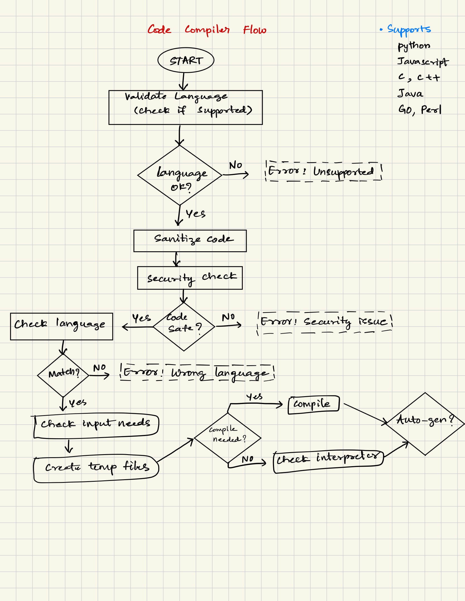
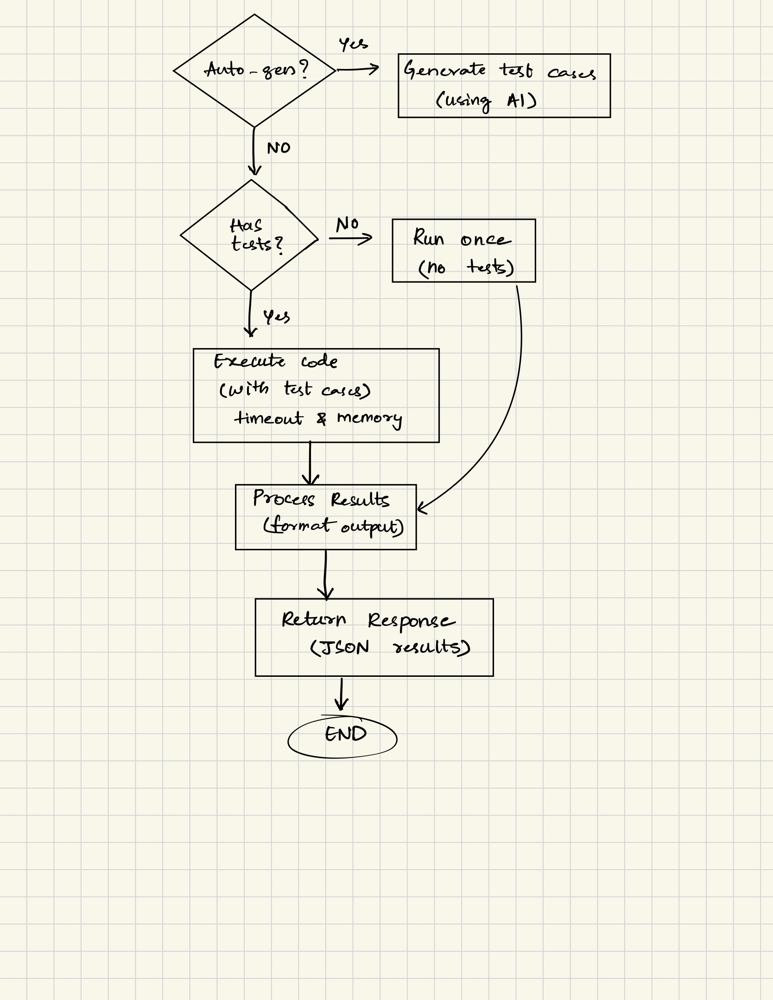

# Code Compiler - Multi Language Support 

"A secure, multi-language code execution API (FastAPI) that runs Python, C, C++, Java, JavaScript, Go and Perl with automatic language detection, on-the-fly test case generation, and strong sandboxing for safety".

final2.py

## Features 

### Core Features 
- Multi language support: Execute code in Python, C, C++, Java, JavaScript, Go, and Perl (can only work if the compilers and interpreters are installed).
- Secure Sandboxing: Resource limits, security validation, and timeout protection.
- Smart Language Detection: Multi-stage validation with weighted pattern matching and syntax checking based on language to avoid mismatch and errors. 
- AI-supported test case generation: Automatic test case generation using OpenAI, Anthropic, or HuggingFace (need API keys)
- Resource Monitoring: Track execution time and memory usage with psutil.
- Flexible Input Handling: Support for both string and array-based test inputs for feasibility and real world application.

### Security Features & Considerations
- Code size limitations (10KB max).
- Execution timeout (5 seconds default).
- Memory limits (150MB max).
- Forbidden pattern detection for dangerous direct interactions & operations with the server.
- Directory traversal protection.
- System file access prevention.

## Prerequisites

This is a python-based application server. So python is needed. 

Install Other languages (as needed)

- gcc: For C compilation
- g++: For C++ compilation  
- javac: For Java compilation
- node: For JavaScript execution
- go: For Go compilation
- perl: For Perl execution

Also, install python dependencies & other libraries from `requirements.txt` file.

Also, install libraries as required. 
- openai: For chatgpt 
- anthropic: For claude
- huggingface_hub: For various open-source models (check the website for more details)

It is recommended to use a virtual environment for this project.

## Config

Setup `.env` file at project root directory for API Keys. 
You can include all or one of them. 


## Usage

Starting the Server - with this command
``` python final2.py ``` or 
``` python3 final2.py ``` on mac.


## API Endpoints

1. POST /run :  Executes code and the main endpoint for the project.
2. GET / : Returns server status and configuration.
3. GET /languages : Returns list of supported languages.


## Common Issues

1. **"Compiler not found"**: Install the required compiler/interpreter for the language.
2. **"Language mismatch"**: The detected language doesn't match the declared one.
3. **"Security violation"**: Code contains forbidden patterns.
4. **"Execution timeout"**: Code exceeded 5-second limit.
5. **Code Parsing**: When we send the post request directly as a string, we need to take care of introducing escape characters to correctly send the JSON request. 


## Project Flow





## Further Improvements

1. Improve test generation prompts as per language. 
2. Improve efficient input handling.
3. Enhance Security Patterns.
4. Rate limiting implementation for robust & real world production.
5. Docker Containerization